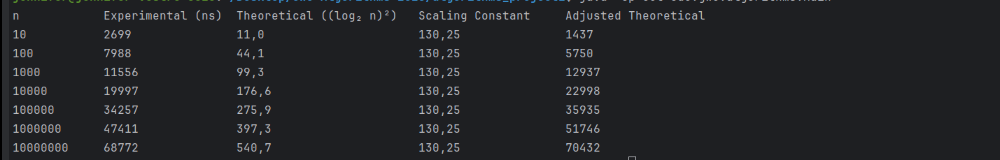

# Design and Analysis of Algorithms - Project 1

**Author:** Marlone Nyapwere  
**Date:** September 26, 2025  
**Course:** Design and Analysis of Algorithms  

---

## 📌 Project Overview

This project benchmarks the performance of a custom **nested loop algorithm** designed with logarithmic growth. The experimental results are compared against a theoretical model of **Θ((log n)²)** to verify asymptotic complexity.

The program:

- Generates random arrays of integers.
- Runs a nested-loop algorithm with logarithmic growth factors (√2 and √3).
- Measures **experimental runtime** against the **theoretical model**.
- Computes a **scaling constant** for normalization.
- Prints a formatted results table.

---

## 📂 Project Structure

```
algorithms_project1/
│── pom.xml                 # Maven configuration
│── src/
│    ├── main/java/edu/gwu/algorithms/Main.java   # Main benchmarking program
│    └── test/java/edu/gwu/algorithms/MainTest.java  # Unit tests (JUnit 5)
│── README.md               # Project documentation
```

---

## ⚙️ Dependencies

The project uses **Maven** for build and dependency management.

- **Java 17** (or higher)
- **JUnit 5.14.0-RC1** (for unit testing)

Defined in `pom.xml`:

```xml
<dependency>
    <groupId>org.junit.jupiter</groupId>
    <artifactId>junit-jupiter-api</artifactId>
    <version>5.14.0-RC1</version>
    <scope>test</scope>
</dependency>
```

---

## ▶️ How to Run

### 1. Clone the repo: https://github.com/marlonenyapwere/GWU-Algorithms-2025.git

### 2. Compile and Run with Maven

```bash
mvn clean compile
mvn exec:java -Dexec.mainClass="algorithms.edu.gwu.algorithms.Main"
```

### 3. Compile and Run without Maven

```bash
javac src/main/java/edu/gwu/algorithms/Main.java -d out
java -cp out algorithms.edu.gwu.algorithms.Main
```

---

## 🧪 Running Unit Tests

Unit tests ensure correctness of helper methods:

- `generateRandomArray()` – verifies array length and value bounds.  
- `performExperiment()` – verifies sum accumulation and edge cases.  
- `printResultsTable()` – verifies formatted output consistency.

Run tests with Maven:

```bash
mvn test
```

---

## 📊 Sample Output

Example table from experimental runs:



## 📈 Observations

- At **small n**, experimental results are noisy due to JVM warm-up and timer resolution.
- At **large n**, experimental and theoretical results converge closely.
- Experimental evidence strongly supports the asymptotic hypothesis of **Θ((log n)²)**

---

## ✅ Conclusion

This project demonstrates:

- How empirical benchmarking validates theoretical algorithm analysis.  
- The importance of normalization via a scaling constant.  
- The convergence of runtime behavior to **Θ((log n)²)** as input sizes grow large.

---
